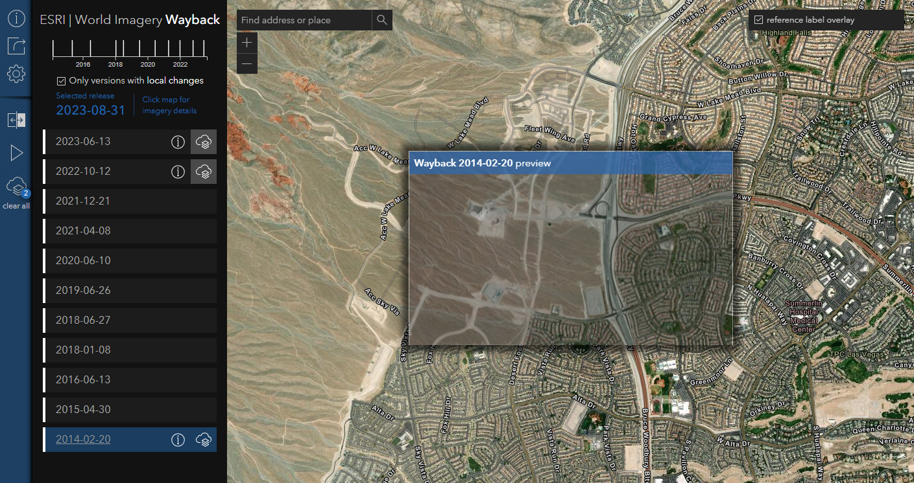

# wayback
This app provides a dynamic browsing experience where previous World Imagery versions are presented within the map, along a timeline, and as a list. Versions that resulted in local changes are dynamically presented to the user based on location and scale. Preview changes by hovering and/or selecting individual layers. When ready, one or more Wayback layers can be added to an export queue and pushed to a new ArcGIS Online web map.

[View it live](https://livingatlas.arcgis.com/wayback/)



## Installing 
To begin, clone this repository to your computer:

```sh
https://github.com/vannizhang/wayback.git
```

From the project's root directory, install the required packages (dependencies):

```sh
npm install
```

## Running the app 
Now you can start the webpack dev server to test the app on your local machine:

```sh
# it will start a server instance and begin listening for connections from localhost on port 8080
npm run start
```

## Deployment
To build/deploye the app, you can simply run:

```sh
# it will place all files needed for deployment into the /build directory 
npm run build
```

## External Libraries:
- [ArcGIS API for JavaScript (4.18)](https://developers.arcgis.com/javascript/index.html)
- [D3.js v4](https://d3js.org/)

## Resources
- [Wayback - 81 Flavors of World Imagery](https://www.esri.com/arcgis-blog/products/arcgis-living-atlas/imagery/wayback-81-flavors-of-world-imagery/)
- [Wayback Imagery group](http://esri.maps.arcgis.com/home/group.html?id=0f3189e1d1414edfad860b697b7d8311&start=1&view=list#content)
- [ArcGIS Living Atlas of the World](https://livingatlas.arcgis.com/en/browse/#d=2&categories=Imagery:1111)
- [Esri](https://www.esri.com/en-us/home)

## Issues

Find a bug or want to request a new feature?  Please let us know by submitting an issue.

## Contributing

Esri welcomes contributions from anyone and everyone. Please see our [guidelines for contributing](https://github.com/esri/contributing).

## Licensing

### The Imagery

The imagery presented in the Wayback app is subject to the terms and conditions set forth in the Esri Master Agreement or Terms of Use.  See [World Imagery](https://www.arcgis.com/home/item.html?id=10df2279f9684e4a9f6a7f08febac2a9) for additional details on the imagery content and applicable Terms of Use.

### The Software

Copyright 2021 Esri

Licensed under the Apache License, Version 2.0 (the "License");
you may not use this file except in compliance with the License.
You may obtain a copy of the License at

   http://www.apache.org/licenses/LICENSE-2.0

Unless required by applicable law or agreed to in writing, software
distributed under the License is distributed on an "AS IS" BASIS,
WITHOUT WARRANTIES OR CONDITIONS OF ANY KIND, either express or implied.
See the License for the specific language governing permissions and
limitations under the License.

A copy of the license is available in the repository's [license.txt](license.txt) file.