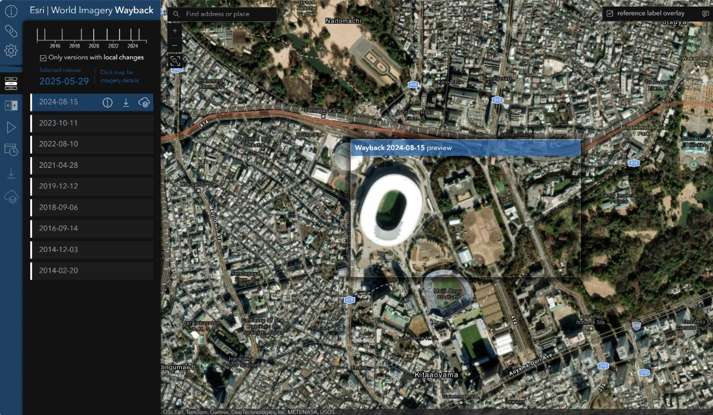

# World Imagery Wayback App
The World Imagery Wayback App provides a dynamic browsing experience where previous World Imagery versions are presented within the map, along a timeline, and as a list. Versions that resulted in local changes are dynamically presented to the user based on location and scale. Preview changes by hovering and/or selecting individual layers. When ready, one or more Wayback layers can be added to an export queue and pushed to a new ArcGIS Online web map.

[View it live](https://livingatlas.arcgis.com/wayback/)



## Looking to integrate Wayback into your own app?

If you want to use the World Imagery Wayback service in your application without the full UI/UX provided by this app, check out the [wayback-core](https://github.com/Esri/wayback-core) repository. It provides the core functionality and APIs for working with Wayback imagery services that you can integrate into your own applications.

## Prerequisites

### Clone the repository
To run this application locally, you need to clone the repository, it is recommended to fork it first, then clone your forked repository to your local machine.

### Node.js and NPM
Ensure you have Node.js and NPM installed on your machine. You can download them from the [Node.js website](https://nodejs.org/en/). The current Long Term Support (LTS) release is recommended for this project.

### Environment Variables
Before running the application, ensure you have a `.env` file in the root directory of the project. You can create this file by copying the provided [`.env.template`](./.env.template) file.

In the `.env` file, you must specify the `ARCGIS_OAUTH_CLIENT_ID`, which is required for authenticating with ArcGIS services. Follow the [How to implement user authentication](https://developers.arcgis.com/documentation/security-and-authentication/user-authentication/how-to-implement-user-authentication/) guide to obtain your OAuth Client ID.

Here is an example of the `.env` file configuration:

```sh
# ArcGIS OAuth Client ID for the application.
# Replace 'your-client-id' with your actual ArcGIS OAuth Client ID.
ARCGIS_OAUTH_CLIENT_ID=your-client-id

# Custom hostname for starting the Webpack Dev server (optional).
# Defaults to 'localhost' if not specified.
WEBPACK_DEV_SERVER_HOSTNAME=my-custom-hostname.com
```

Make sure to replace `your-client-id` with your actual ArcGIS OAuth Client ID.

## Usage

### Installing Dependencies

From the project's root directory, install the required packages (dependencies):

```sh
npm install
```

### Running the App

To test the app on your local machine, start the webpack dev server:

```sh
# This will start a server instance and begin listening for connections from localhost on port 8080
npm run start
```

### Building for Deployment

To build and prepare the app for deployment, run:

```sh
# This will place all files needed for deployment into the /build directory
npm run build
```

## Resources
- [Wayback - 81 Flavors of World Imagery](https://www.esri.com/arcgis-blog/products/arcgis-living-atlas/imagery/wayback-81-flavors-of-world-imagery/)
- [A Fresh Look for Wayback](https://www.esri.com/arcgis-blog/products/arcgis-living-atlas/imagery/a-fresh-look-for-wayback/)
- [World Imagery Wayback Export](https://www.esri.com/arcgis-blog/products/arcgis-living-atlas/imagery/wayback-export/)
- [World Imagery Wayback - 2025 Enhancements](https://www.esri.com/arcgis-blog/products/arcgis-living-atlas/imagery/world-imagery-wayback-2025-updates)
- [Wayback Imagery group](http://esri.maps.arcgis.com/home/group.html?id=0f3189e1d1414edfad860b697b7d8311&start=1&view=list#content)
- [ArcGIS Living Atlas of the World](https://livingatlas.arcgis.com/en/browse/#d=2&categories=Imagery:1111)

## Issues

Find a bug or want to request a new feature?  Please let us know by submitting an issue.

## Contributing

Esri welcomes contributions from anyone and everyone. Please see our [guidelines for contributing](https://github.com/esri/contributing).

## Licensing

### The Imagery

The imagery presented in the Wayback app is subject to the terms and conditions set forth in the Esri Master Agreement or Terms of Use.  See [World Imagery](https://www.arcgis.com/home/item.html?id=10df2279f9684e4a9f6a7f08febac2a9) for additional details on the imagery content and applicable Terms of Use.

### The Software

Copyright 2024 Esri

Licensed under the Apache License, Version 2.0 (the "License");
you may not use this file except in compliance with the License.
You may obtain a copy of the License at

   http://www.apache.org/licenses/LICENSE-2.0

Unless required by applicable law or agreed to in writing, software
distributed under the License is distributed on an "AS IS" BASIS,
WITHOUT WARRANTIES OR CONDITIONS OF ANY KIND, either express or implied.
See the License for the specific language governing permissions and
limitations under the License.

A copy of the license is available in the repository's [LICENSE](LICENSE) file.